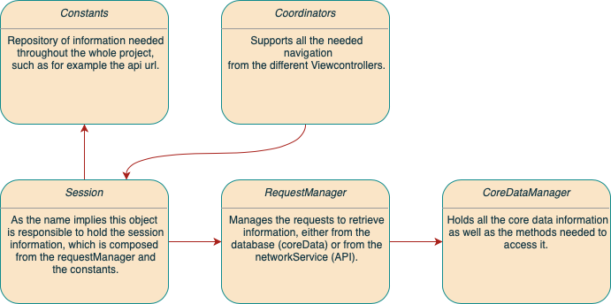

# Fuze-Tech-Task

This project consists in an app that retrieves tweets form a mock API and displays them in a collection view, it also supports adding a new tweet to the list.

## Disclaimer

Publish since Fuze was acquired by 8x8 and this tech task is not longer relevant for hiring purposes.

## Features

- MVVM-C architecture
- CoreData to save tweets data in memory
- Log in session
- Logging using os_log
- Unit testing to make sure the functionality is working as expected
- Localization with support for Portuguese and English

## Project structure

